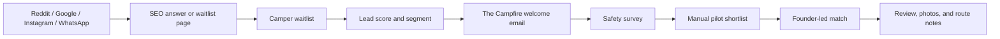
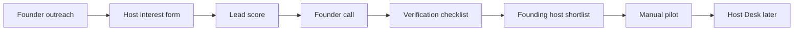
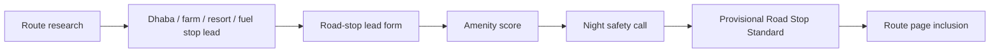

# CampIn Airbnb-Learning UX System

Created: 2026-05-20

This system translates marketplace UX lessons into CampIn-original screens, components, and flows. It should guide prototypes before the public website is expanded.

## Design Position

CampIn is not "Airbnb for camping" visually. CampIn is India's verified outdoors layer: quieter, safer, more operational, and more field-ready. The interface should feel trustworthy enough for first-time campers and efficient enough for hosts, route-stop operators, and founder-led verification.

## Product Navigation Model

### Current Pre-Website Navigation

- Home: brand promise and first proof.
- Explore: sample stays and road-stop discovery.
- Validate: lead capture, targets, and local validation dashboard.
- Host: founding host application.
- Support: trust, help, and operating principles.

### Future App Navigation

- Discover: search, categories, routes, road stops, and curated collections.
- Trip Plan: packing list, route, weather, host note, check-in, emergency contacts.
- CampChat: founder, host, camper, and group coordination.
- Proofbook: camper preferences, responsible camping pledge, reviews, gear readiness.
- Host Desk: applications, site checks, booking requests, payouts, guest rules.

## Core UX Principles

1. Permission before prettiness: users must know whether they can legally and respectfully camp.
2. Amenities before adjectives: washroom, water, parking, power, food, and access beat vague "beautiful view" claims.
3. Trust is dimensional: show what has been checked, what is host-declared, and what is unknown.
4. Mobile-first, road-realistic: the interface must work for weak signal, anxious trip planning, and WhatsApp-native users.
5. Original category discovery: use icons and filters to help people browse by outdoor intent, not by generic accommodation type.
6. Manual booking clarity: before the booking engine, every flow should say when a founder will manually coordinate.

## Camper Discovery Flow

### Required Screens

- Search answer page: direct answer, safety note, permission note, nearby regions, form CTA.
- Region page: Bangalore, Coorg, Wayanad, Chikmagalur, Ramanagara, Kanakapura.
- Category page: Own Tent Friendly, First-Time Safe, Road Stops, Family Safe, Washroom Verified.
- Listing detail prototype: trust panel first, gallery second, pricing third, host story fourth.
- Manual request flow: date, group size, own gear, safety concern, region, WhatsApp opt-in.

### Trust Hierarchy On Listing Detail

1. Permission status.
2. CampIn review status.
3. Washroom and water.
4. Night safety and host presence.
5. Route and vehicle access.
6. Exact pin or meeting point.
7. Photos and campsite type.
8. Price and add-ons.
9. Rules and responsible camping pledge.
10. Reviews and incident history.

## Host Onboarding Flow

### Host Form UX

- Use plain operational language: "Do campers have a usable washroom?" not "Amenities."
- Ask for location pin early.
- Treat permission as required, not optional.
- Capture phone and email, but explain why.
- Let hosts submit photos as links until file uploads are wired to storage.
- Show a "what happens next" confirmation after submit.

### Future Host Desk Modules

- Site profile completion.
- Amenity checklist.
- Permission documents.
- Photo quality guide.
- Calendar intent.
- Price suggestion.
- Rules builder.
- Verification score.
- Guest request inbox.
- Payout tracker.
- Incident log.

## Road-Stop Flow

Road stops should not pretend to be campsites. They are safe, permissioned overnight or late-evening support points for campers, bikers, campervans, and road-trippers.

## Component Inventory

### Discovery Components

- Category rail with original CampIn icons.
- Region search input.
- Trust filter panel.
- Map/list toggle.
- Route card.
- Road-stop card.
- Listing card with trust chips.
- Empty-state lead capture.

### Listing Components

- Trust stack panel.
- Amenity grid.
- Route access panel.
- Host note.
- Responsible camping rules.
- Manual request CTA.
- Safety FAQ.
- Review proof block.

### Validation Components

- Camper waitlist form.
- Host interest form.
- Road-stop lead form.
- Newsletter signup.
- Validation target dashboard.
- CSV export.
- Manual proof counters.
- Source insight inbox.

### Host Components

- Host application status.
- Verification checklist.
- Amenity editor.
- Photo guide.
- Rules builder.
- Candidate score.
- Founder call note.

## Visual Language

- Shapes: 8px radius maximum for cards and controls unless the existing component requires otherwise.
- Palette: forest, off-white, orange, warm neutral, and utility status colors. Avoid turning the product into a single-hue green or orange theme.
- Type: compact operational headings on dashboards; bigger display type only on true hero surfaces.
- Icons: 24px line icons with consistent stroke, rounded joins, and no Airbnb icon copying.
- Imagery: actual campsite, road, host, route, gear, and amenity proof. Avoid decorative nature stock where users need inspection.

## Page Blueprint Before Website Build

### Page: Camping Near Bangalore

- Direct answer: where camping is possible, with permission note.
- Category rail: own tent, family safe, bike trip, road stop, washroom verified.
- Validation CTA: join Bangalore camper waitlist.
- Original data block: top safety concerns from CampIn waitlist.
- FAQ: permission, washrooms, best season, own tent, couples/families, price.
- Schema: FAQPage, LocalBusiness where appropriate later, BreadcrumbList.

### Page: Host Your Land For Camping

- Direct answer: who qualifies.
- Host application CTA.
- Trust standard preview.
- What CampIn verifies.
- Payout and expectations.
- FAQ: permission, safety, guests, pricing, cancellations, damage.

### Page: Road Stops For Campervans In India

- Direct answer: what a road stop is and is not.
- Route lead CTA.
- Amenity standard.
- Vehicle access guide.
- Partner pitch.

## Prototype Testing

Test each flow with 5 campers and 5 hosts before expanding the website:

- Completion time.
- Trust objections.
- Words users do not understand.
- Whether users share phone/email.
- Whether hosts understand verification.
- Whether campers understand manual booking.
- Whether road-stop operators understand the product.

## UX Quality Bar

The screen is not ready if:

- A user cannot tell what is verified versus host-declared.
- A camper cannot see washroom and water information quickly.
- A host cannot understand why permission status matters.
- The page sells a dream before explaining practical safety.
- CTAs imply instant booking before CampIn can fulfill it.
- The design depends on copying Airbnb's exact visual choices.
